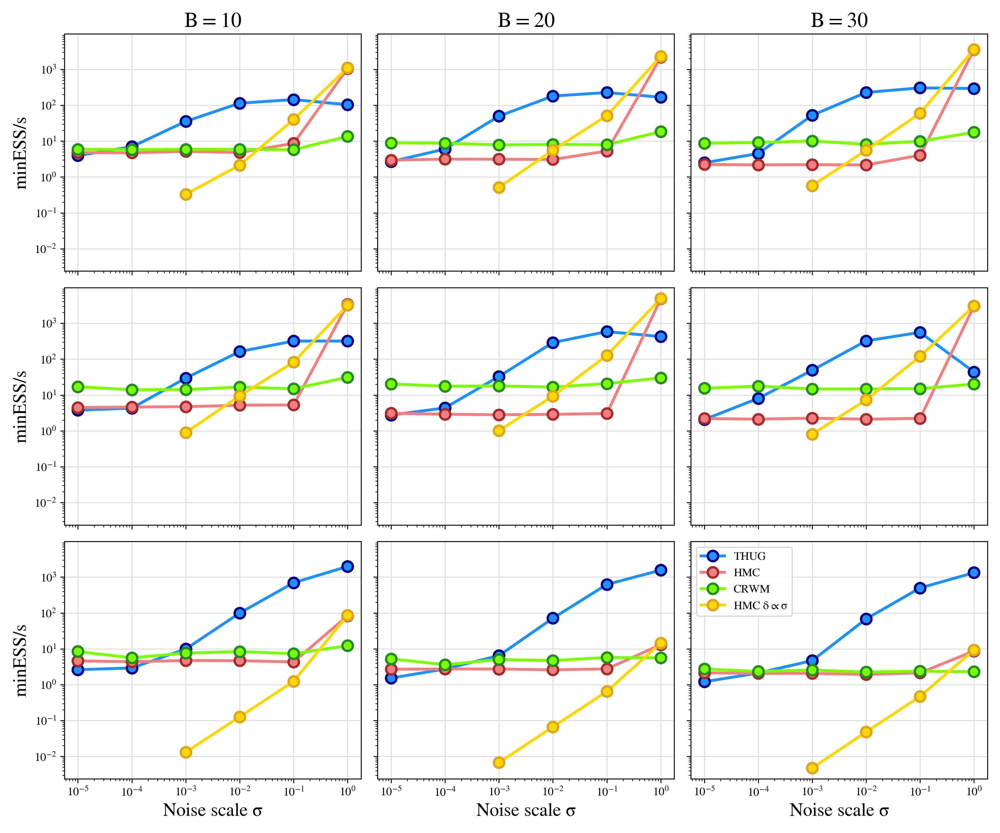

# Experiments on 2D Bayesian Inverse Problem
Experiments on a simple 2D Bayesian Inverse Problem using Approximate Manifold Sampling. We compare Tangential Hug (THUG) with Constrained-RWM and Hamiltonian Monte Carlo. The figure for the main part of the thesis is shown below and found with `B=20` integration steps and step size `delta=0.1`, `N=2500` samples and `11` independent chains. The y-axis shows the `minESS` (computed via `arviz`) divided by total runtime for the three algorithms as the noise scale decreases. 

The plot below shows the same quantities but for a grid of integration steps and step sizes. The first row corresponds to `delta=0.05` and the second row to `delta=0.1`. The columns correspond to `B=10,20,30` respectively.

Finally, we show also the raw minESS since sometimes very low minESS values can be misleading when presented in `minESS/runtime` form.

HMC and THUG samples for `sigma=1.0`.

